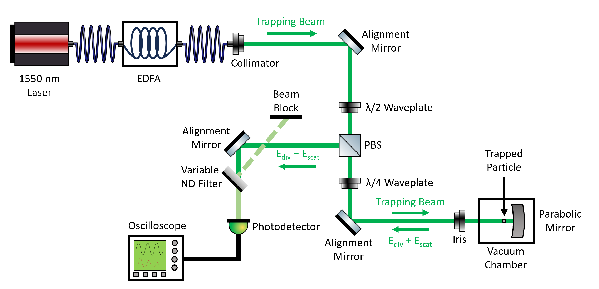
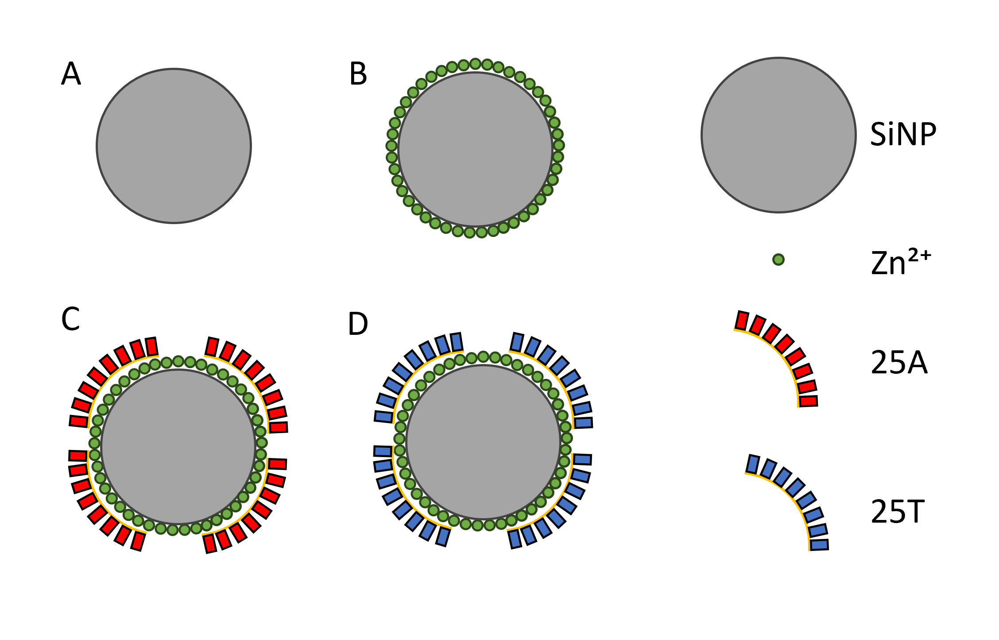

---
# Oligonucleotide Selective Detection by Levitated Optomechanics
This NATS3005 research project was carried out at the [University of Southampton](https://www.southampton.ac.uk/) under the supervision of [Prof Hendrik Ulbricht](https://www.southampton.ac.uk/people/5x5wz8/professor-hendrik-ulbricht).

100 nm diameter silica nanoparticles (SiNPs) with different surface modifications were optically trapped using the setup in the diagram below. 

Zinc chloride (ZnCl₂) was selected as a binding agent for the DNA to the surface of SiNPs. This process is described in a paper [here](https://www.sciencedirect.com/science/article/pii/S0026265X21011036?casa_token=qXb5c-y2FJEAAAAA:MZD2fGdQ71L7qJOeOZ268KRTaBZ1gdS5Pbs4r-UI-nAAyVTxetroGB1i0l2SAO8d-svBXGdn). The chosen oligonucleotides for this project are 25A (a 25-mer of deoxyadenosine monophosphate) and 25T (a 25-mer of deoxythymidine monophosphate). A schematic of the surface modifications can be seen below.

These oligonucleotides were ordered from [Integrated DNA Technologies](https://eu.idtdna.com/page). Following release of these particles as an aerosol from a [nebuliser](https://www.omron-healthcare.co.uk/products/microair-u100) in the vacuum chamber, the pressure was reduced to around 3.5 to 3.6 mbar. The waveform of the particles was recorded on an oscilloscope. The code presented in this repository was then used to generate the power spectral density plots, as well as the dataset and final plots. For more information on the methodology, please refer to the paper itself.

---
### Software and package versions with documentation links
- [Python 3.8.20](https://www.python.org/downloads/release/python-3820/)
- [Customtkinter 2.2.0](https://pypi.org/project/customtkinter/)
- [Matplotlib 3.7.5](https://matplotlib.org/3.7.5/)
- [Numpy 1.24.4](https://numpy.org/doc/stable/release/1.24.4-notes.html)
- [Optoanalysis 4.3.2](https://pypi.org/project/optoanalysis/)
- [Pandas 2.0.3](https://pandas.pydata.org/pandas-docs/version/2.0.3/)
- [RTxReadBin 1.0](https://www.rohde-schwarz.com/us/applications/working-with-acquired-waveform-data-in-python-application-card_56279-1165008.html)
- [Scikit-image 0.21.0](https://scikit-image.org/docs/stable/release_notes/release_0.21.html)
- [Scikit-learn 1.3.2](https://scikit-learn.org/1.6/whats_new/v1.3.html)
- [Scipy 1.10.1](https://docs.scipy.org/doc/scipy-1.10.1/)
- [Seaborn 0.13.2](https://seaborn.pydata.org/installing.html)
- [Statsmodels 0.14.1](https://www.statsmodels.org/stable/index.html)
- [Tqdm 4.67.1](https://tqdm.github.io/)

---
### Installation instructions for the packages used that are not included in the standard python library using `pip`
- `pip install customtkinter==2.2.0`
- `pip install matplotlib==3.7.5`
- `pip install numpy==1.24.4`
- `pip install optoanalysis==4.3.2`
- `pip install pandas==2.0.3`
- `pip install RTxReadBin-1.0-py3-none-any.whl` Note, this `.whl` file is available in this repository.
- `pip install scikit-image==0.21.0`
- `pip install scikit-learn==1.3.2`
- `pip install scipy==1.10.1`
- `pip install seaborn==0.13.2`
- `pip install statsmodels==0.14.1`
- `pip install tqdm==4.67.1`

To check that these packages are installed, use the `pip list` command to see all installed packages and their versions available to be viewed with `pip`.

---
